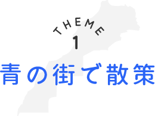
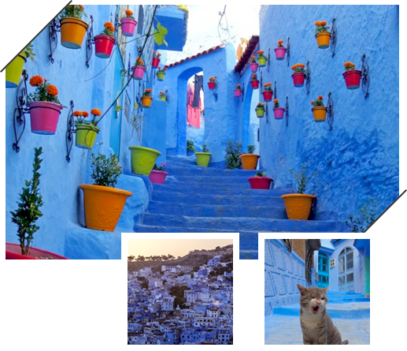
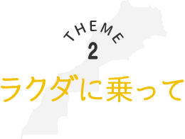
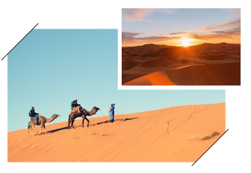
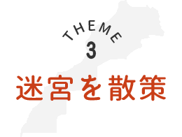
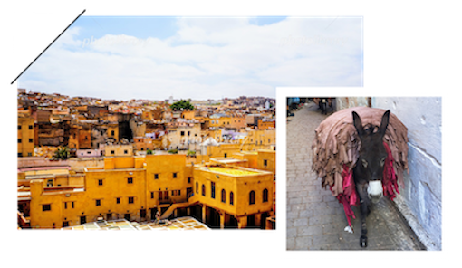

# ina-miina.github.io
<!DOCTYPE html>
<html lang="ja">
<head>
  <meta charset="utf-8">

  <title>3つのテーマでめぐるモロッコ</title>

  <link rel="stylesheet" href="reset.min.css" /> <!-- reset.min.css -->
  <link rel="stylesheet" href="style.css" /> <!-- style.css -->

</head>
<body>

  <!-- ↓メインビジュアル ここから-->
  

    <h1>
			
		</h1>
  

  <!-- ↑メインビジュアル ここまで-->

  <!-- ↓ディスクリプション〜テーマの部分 ここから-->
  

    

      
青の街や赤の街。迷宮のような市場。どこまでも続く朱色の砂漠。 
			その幻想的な景色は、きっと忘れられない思い出に。 
			そんなエキゾチックな旅をしませんか？

    

    

      <a href="#">ツアー情報をみる</a>
    

    <!-- ↓1テーマ ここから -->
    

      <h2>
				
			</h2>

      <!-- flexコンテナー -->
      

        

          
        

        

          <h3>
						</h3>
          
モロッコ北部のリーフ山脈の懐深く、標高約600mの山麓にティシュカ山(2050m)とメッグ山(1616m)に挟まれるように佇む人口約4万人の小さな町がシャウエンです。 
						“青い宝石箱”とも呼ばれる通り、家の壁や路地が美しい青色で彩られたシャウエンの旧市街は、まるでおとぎ話の世界に迷い込んだような幻想的な空間です。
					

        

      

      <!-- ↑1テーマ ここまで-->
      <!--↓2テーマ　ここから-->
      <h2>
				
			</h2>

      <!-- flexコンテナー -->
      

        

          
        

        

          <h3>
						</h3>
          
アフリカ大陸の約３分の１、モロッコの約6割を占めている世界最大の砂漠。なんとその広さはアメリカ合衆国とほぼ同じ面積！ 
						往復1時間もの間ラクダに乗れるのはモロッコならでは！サハラ砂漠で見る朝日はあなたにとって忘れられない思い出に。
						

        

      

    

    <!--2テーマ　ここまで-->
    <!--↓3テーマ ここから-->
    

      <h2>
						
			</h2>

      <!-- flexコンテナー -->
      

        

          
        

        

          <h3>
								</h3>
          
世界一迷子になると言われている旧市街。過去のイスラム王朝の多くが王都にしていた為、外敵からの侵入を防ぐよう街並みが複雑になったそうです。 
					伝統的な「タンネリ」が街中に独特の香りを放っています。その染物を運ぶロバが間近で見れるのは道幅の狭いフェズならではの風景 
					まるでタイムスリップしたかのような気分に。
							

        

      

      <!--↑3テーマ ここまで-->

    

    <!-- ↑flexコンテナー ここまで-->
  

  

  <!-- ↑ディスクリプション〜テーマの部分 ここまで -->

  <!-- ↓導線部分 ここから -->
  

    

      <h2>
				
			</h2>
      <!--横並びのボタン ここから -->

      

        

          <a href="#">ツアー情報をみる</a>
        

        

          <a href="#">航空券＋ホテルを探す</a>
        

        

          <a href="#">航空券を探す</a>
        

        

          <a href="#">ホテルを探す</a>
        

      

      <!-- ↑横並びのボタン ここまで-->
    

  

  <!-- footer -->
  <footer>
    
SHE travel All Rights Reserved.

  </footer>
</body>
</html>
